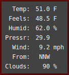
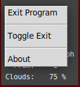

# Desktop Weather Panel
A small GUI weather panel for the desktop






Get persistent accurate weather on your desktop.

This app uses https://home.openweathermap.org/api_keys to  
retrieve weather data at 10 minute intervals.

You will have to obtain your own free API Key from openweathermap.org  
and place it into the code.

The panel has a caption you use to position it onto your screen.

The "Toggle Exit" option in the context menu toggles the  
application's caption per execution.  

Python3 Modules  
```python
from tkinter import *
from tkinter.ttk import *
from tkinter import messagebox
import os
import sys
from pathlib import Path
import requests
import threading
from ttkthemes import ThemedTk
```
